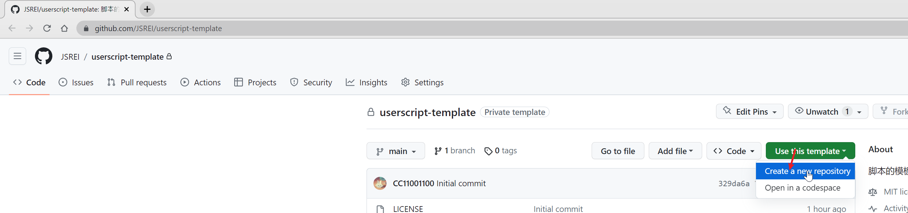
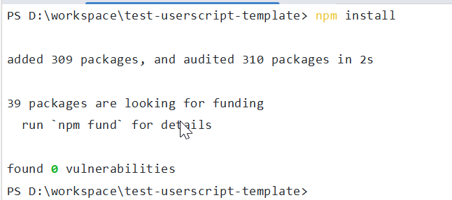
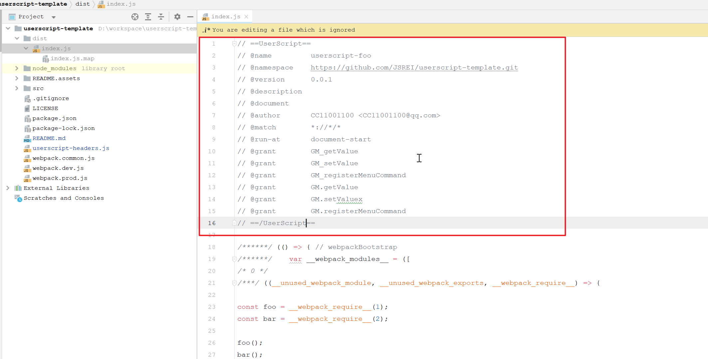
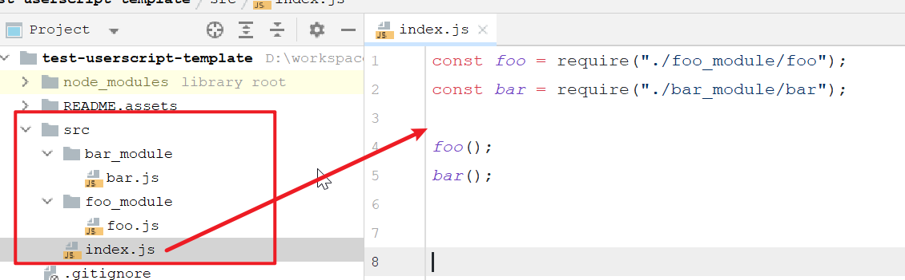
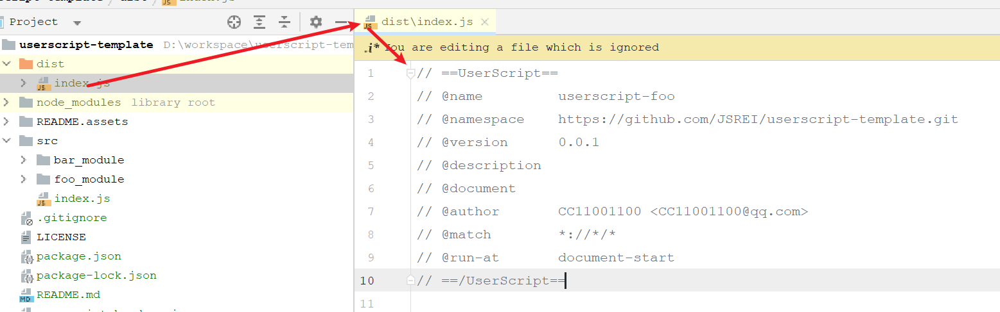

# UserScript Template 

# 一、这是什么

使用`NodeJS`+`WebPack`开发油猴脚本的方案，用于提升油猴开发体验，一个`JavaScript`文件几千行来回改本人真的有点顶不住......

# 二、如何使用

在当前仓库选择“Use this template” --> “Create a new repository”，创建一个新的仓库： 



选择存放的位置以及设置仓库名字等等：


仓库创建好了克隆到本地，在项目根目录下执行命令安装依赖：

```bash
npm install
```

安装依赖可能会花点时间，稍微耐心等待一会儿： 



如果依赖安装过慢或者下载不下来，可以为`npm`配置国内镜像源或者使用`cnpm`。

然后修改`package.json`文件，把相关字段替换为你自己的，比如名字、作者、仓库地址等等：

```js
{
  "name": "userscript-foo",
  "version": "0.0.1",
  "main": "index.js",
  "repository": "https://github.com/JSREI/userscript-template.git",
  "scripts": {
      // ... 
  },
  "author": "CC11001100 <CC11001100@qq.com>",
  "license": "MIT",
  "devDependencies": {
      //...
  }
}
```

在项目根目录下的`userscript-headers.js`文件中存放的是默认的油猴头文件，在`webpack`编译的时候会把这个文件放到编译后的文件的头部作为油猴的插件声明：

```js
// ==UserScript==
// @name         ${name}
// @namespace    ${repository}
// @version      ${version}
// @description  ${description}
// @document     ${document}
// @author       ${author}
// @match        *://*/*
// @run-at       document-start
// ==/UserScript==
```

`${name}`、`${version}`这种是支持的一些变量，在编译的时候会从`package.json`中获取对应的值替换掉，这样对于这些可能会重复或者一直变的内容我们就可以从一个源引用使用而不用重复设置或者反复修改了，如果默认的配置不能满足你的要求，你可以直接修改这个头文件，比如为其增加权限：

```js
// ==UserScript==
// @name         ${name}
// @namespace    ${repository}
// @version      ${version}
// @description  ${description}
// @document     ${document}
// @author       ${author}
// @match        *://*/*
// @run-at       document-start
// @grant        GM_getValue
// @grant        GM_setValue
// @grant        GM_registerMenuCommand
// @grant        GM.getValue
// @grant        GM.setValuex
// @grant        GM.registerMenuCommand
// ==/UserScript==
```

除了变量替换其他内容都会被原样保留，这是编译后的样子：



然后就可以开心的写代码了，在编写代码的时候你可以使用`npm`命令为项目添加依赖，对于一个稍微复杂点的脚本而言很可能会引用外部的依赖：

```bash
npm add xxx
```

但是需要注意，这些依赖最终会被打包进`./dist/index.js`，而这个文件是不适合太大的，所以尽可能不要引用太多的第三方库。

同时你现在可以在`src`目录下以模块化的方式组织你的代码，而不必像之前那样来回上下拉扯一个几千行的`JavaScript`文件，单文件开发那简直是一种对脑力的摧残...



当你需要测试的时候，执行：

```bash
npm run watch
```

然后把`./dist/index.js`中的文件头复制到你的油猴中：



并在最后添加一行引入编译后的文件，注意这个`file://`后面的地址是指向你的编译后的`./dist/index.js`的绝对路径：

```js
// @require    file://D:/workspace/userscript-template/dist/index.js
```

比如下面是一个开发时使用的油猴脚本的实际例子，油猴中没有实际代码，而是使用`require`指向我们`build`后的文件，这样当修改完代码`webpack`自动热编译的时候浏览器中引用的`./dist/index.js`也是最新的：

```js
// ==UserScript==
// @name         userscript-foo
// @namespace    https://github.com/JSREI/userscript-template.git
// @version      0.0.1
// @description  
// @document     
// @author       CC11001100 <CC11001100@qq.com>
// @match        *://*/*
// @run-at       document-start
// @require    file://D:/workspace/userscript-template/dist/index.js
// ==/UserScript==
(() => {})();
```

也许你会注意到，当你使用`npm run watch`运行的时候，命令执行时编译完代码并没有退出而是进入了等待状态，是的，就像它的名字一样，它相当于是启动了一个`watch`模式，当你改动源代码文件的时候`webpack`都会帮你重新编译你的代码，而你需要做的就是直接修改你的代码，然后切换到浏览器刷新即可！（这里没有引入浏览器自动刷新，是否有这个必要呢？）

当你需要发布的时候：

```bash
npm run build
```

然后把`./dist/index.js`文件拿去发布即可。


